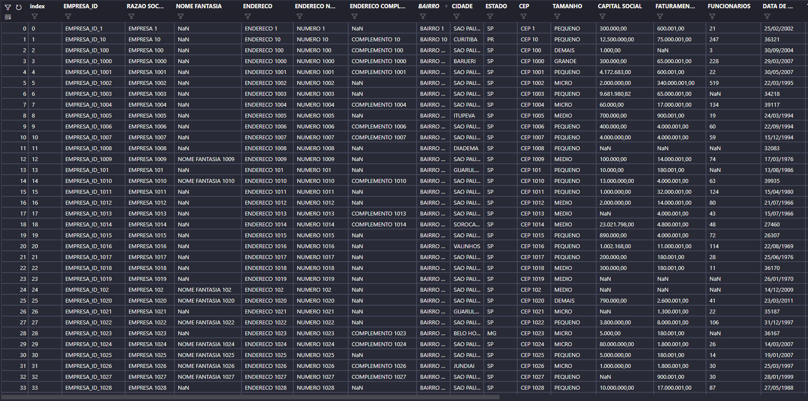

## Estruturação de Dados

Com base na tabela de dados não estruturada, foi realizada a análise de possíveis padrões para classificar e categorizar os dados a partir disto.

### Dados Não Estruturados

Além do preenchimento dos valores nulos com valores médios e a identificação de padrões de colunas que se correlacionam, dados de faturamento e quantidade de funcionários foram categorizados. A tabela final apresenta os dados estruturados e classificados de acordo com os padrões identificados.

### Dados Estruturados

## Resumo dos Dados

Linguagem de programação Python.
Bibibliotecas utilizadas:
- pandas 
- numpy

## Contato
henriquegoldani@gmail.com

## Linkedin
https://www.linkedin.com/in/henrique-goldani/
